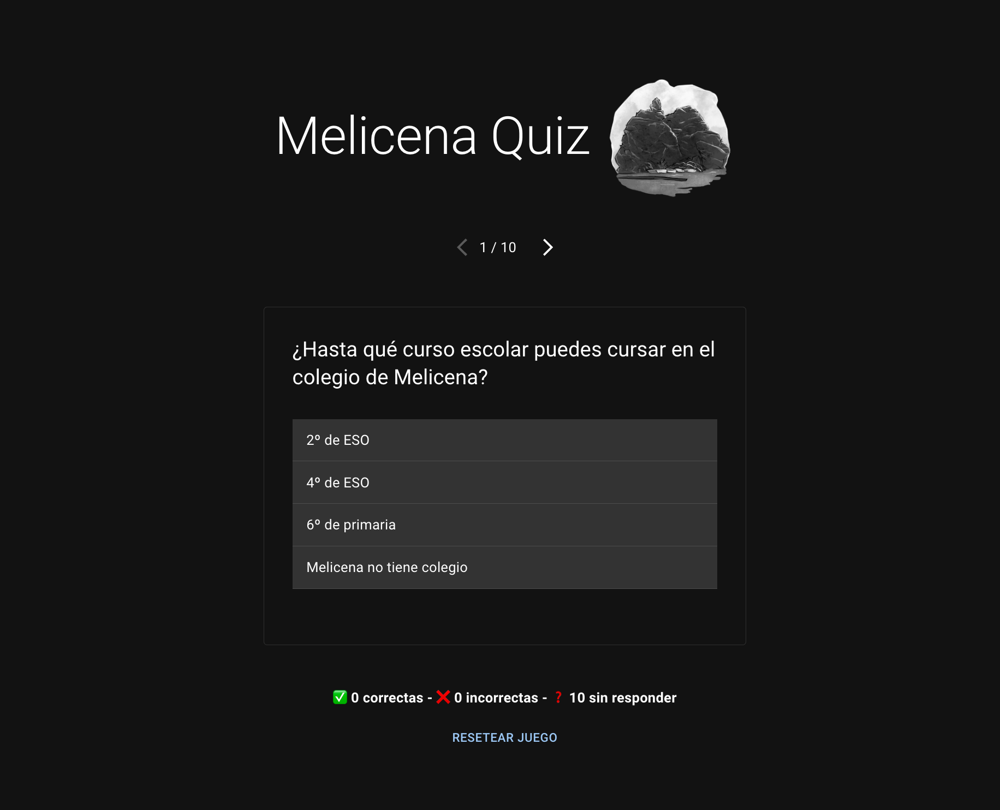

# 🪨 Melicena Quiz

Pequeño quiz que presenta 10 preguntas aleatorias sobre Melicena, el mejor pueblo de la costa granaína. La aplicación está hecha con React y TypeScript. Utiliza Zustand como gestor de estado y es una idea que realizó midudev en un directo en Twitch.

## 🔗 Link del deploy

QUIZ: https://melicena-quiz.vercel.app/
PÁGINA con los resultados: https://www.melicena.es/quiz

## 📝 To Dos

- [x] Crear un modal con unos resultados variables, dependiendo de la cantidad de correctas. El modal se abrirá en cuanto no queden preguntas por responder.
- [x] Crear un store con usuarios que participan en la encuesta (nombre, puntuacion)
- [x] Mostrar un listado de los usuarios
- [x] No permitir crear un usuario si ya existe otro con el mismo nombre
